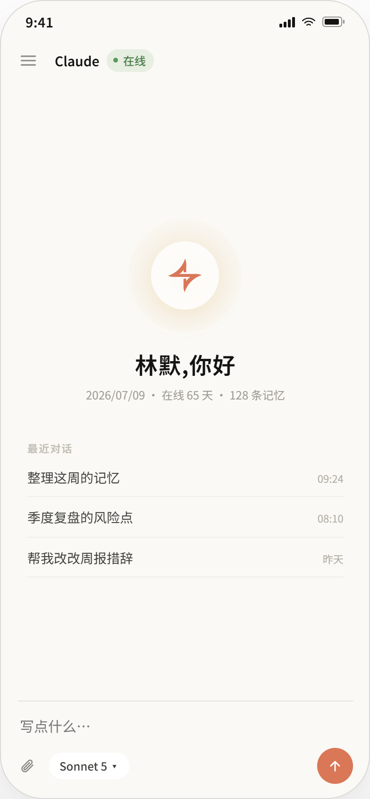
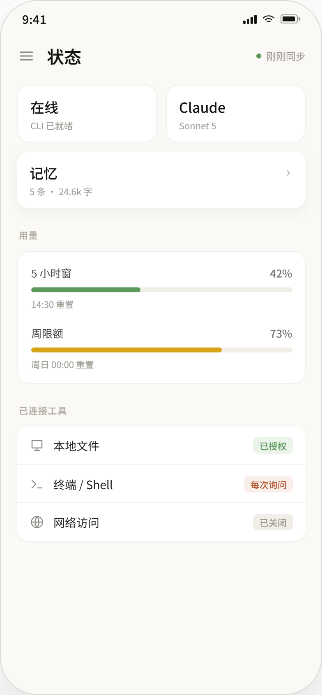

# Pando

[](https://github.com/Eloise-Aspen/pando-bridge/actions/workflows/test.yml)

**简体中文 | [English](#english)**

> Pando 得名于已知最大的白杨无性系群落——单一有机体在地下蔓延，地表长成整片森林。
> 一套根系，多个枝干：一个 hook 化的内核，多座桥。

---

<a id="简体中文"></a>

**Pando** 是一个**自托管的 Claude Code CLI 移动网关**。跑在你自己的机器上，从手机访问
（PWA、反向代理，或 Tailscale/Cloudflare 这类私有隧道），随时随地和 Claude Code 对话。
内核是一个薄薄的 FastAPI 应用，调用你本地装好的 `claude` 二进制，把结果经 WebSocket
流式吐回——应用里没有 API key，数据不出你的机器。

内核自带**零记忆逻辑**。记忆是可选、可插拔的外部服务（见 [4 端点契约](#记忆契约)）；
插件通过[文档化的钩子](#插件钩子-api)扩展行为。开箱即用、不配记忆服务时，Pando 就是一个
干净的 Claude Code 远程终端。

<p align="center">
  
  &nbsp;&nbsp;
  
</p>

---

## 为什么用 Pando？（vs. 官方远程访问）

Anthropic 提供了第一方的 Web/移动端 Claude Code 访问。Pando 不想取代它——它是给那些想
**掌控整条栈**的人准备的。2026 年初，通过 OAuth 骑在 Claude *订阅*上的第三方工具被切断；
Pando 完全绕开这点，直接驱动你自己已安装、已认证的 `claude` CLI。没有任何一方经手你的凭证。

| | Pando | 第一方远程 |
|---|---|---|
| **托管** | 自托管在你的机器上 | Anthropic 托管 |
| **数据** | 聊天记录在你自己的 SQLite；记忆在你自己的服务里 | 厂商管理 |
| **记忆** | 可插拔——任何引擎接入 4 端点 HTTP 契约即可 | 固定 |
| **成本模型** | 复用你现有的 Claude Code CLI / 订阅 | 按产品条款 |
| **可扩展性** | 注入、路由、会话源的插件钩子 | 封闭 |
| **界面** | 沉浸式聊天 + 侧边栏导航 + 附件上传（图片/PDF 交给 Claude 看），内置可切换主题（简洁为默认，`static/themes/<名>/theme.css` 覆盖 token） | 固定 |

如果你只想要官方体验，用官方产品就好。如果你想自托管、掌控自己的数据、接入自己的
记忆——这就是它的用途。

---

## 快速开始

纯终端，不接记忆服务，约 5 分钟。你需要 **Python 3.10+** 和已安装并认证的
**Claude Code CLI**（`claude` 在 `PATH` 里）。

动手前先确认 CLI 真的能用：

```bash
claude --version
claude -p "hi"
```

如果 CLI 还没认证，`claude -p "hi"` 会卡住不返回、提示登录，或者直接报错，而不是正常
输出一句回复——先交互式跑一次 `claude` 完成登录认证，再继续下面的步骤。

```bash
git clone https://github.com/Eloise-Aspen/pando-bridge.git
cd pando-bridge
pip install -e .
```

仓库带了一份 [`run.example.py`](run.example.py)，复制成 `run.py` 改一行 `CLAUDE_CWD`
就能跑（`cp run.example.py run.py`，Windows 用 `copy`）。它长这样（`CLAUDE_CWD` 必须是
一个已经存在的目录，建议指向你想让 Claude 工作的项目目录；不配 `MEMORY_SERVICE_URL`
就是纯终端模式，默认 `NullMemoryProvider` 什么记忆都不做）：

```python
import os

import uvicorn
from pando import create_app

app = create_app({
    "CLAUDE_EXE": "claude",                  # 或 CLI 的绝对路径
    "CLAUDE_CWD": "/path/to/your/project",   # 必须已存在——你想让 Claude 工作的目录
    "DATA_DIR": "./data",                    # chat.db 存这里
    # 省略 MEMORY_SERVICE_URL -> NullMemoryProvider = 纯终端
})

if __name__ == "__main__":
    # 0.0.0.0 绑定所有网卡,好让局域网设备(比如你的手机)能连上——
    # 配合下方"手机接入"里的安全提示一起看
    uvicorn.run(app, host="0.0.0.0", port=int(os.environ.get("BRIDGE_PORT", 8765)))
```

```bash
python run.py
```

> **Windows 注记**——以上步骤在 PowerShell 里照抄即可（Windows 11 + Python 3.10
> 实测通过）。两个平台差异：`CLAUDE_CWD` 用正斜杠写（`"C:/Users/you/project"`，
> 反斜杠在 Python 字符串里是转义符）；环境变量用 PowerShell 写法设置：
> `$env:BRIDGE_PORT = "8899"; python run.py`。

浏览器打开 <http://127.0.0.1:8765> 即是自带的 PWA 前端，接到 `/ws` WebSocket。发一条
消息，Claude Code 就会回，流式吐出 thinking/text/tool-use。这就是全部循环。默认端口
`8765`，被占用时设置环境变量 `BRIDGE_PORT`——Linux/macOS 写 `BRIDGE_PORT=8899 python run.py`，
PowerShell 写 `$env:BRIDGE_PORT = "8899"; python run.py`——或改上面 `run.py` 示例里的
端口即可，不用改包源码。想在手机上用——这才是重点——见 [📱 手机接入](#-手机接入)。

见 [`.env.example`](.env.example) 了解每一个配置开关。

---

## 用量额度显示

设置页顶部会显示两条利用率进度条——**5 小时窗**与**周限额**——对齐 Claude 官方 `/usage`
的形态,各带重置时间。数据来自官方(非公开)用量端点 `api.anthropic.com/api/oauth/usage`,
OAuth token 取自本机 Claude Code 的凭证文件 `~/.claude/.credentials.json`(或 `CLAUDE_CONFIG_DIR`
指向的目录)。

- **需要**:本机已用 Claude **订阅**登录过 Claude Code,且凭证以文件形式存在(Windows /
  Linux / WSL 均是文件——已在 Windows 与 WSL 两端实测返回 200)。
- **token 只读、不出服务端**:只读该文件、不写、不进日志、不进响应;进度条只在打开设置页时拉一次,不轮询。
- **自动降级(聊天永不受影响)**:凡是拿不到实时额度——未登录 / API 模式(`ANTHROPIC_*`)/
  macOS 用 Keychain 存凭证 / token 过期 / 端点限流——进度条区自动改为显示**本机 token 累计统计** +
  一行说明,不报错、不卡死。

> 该端点非公开、可能变动,且 access token 约 1 小时过期(Claude Code 使用时会自动刷新并回写文件)。
> 因此进度条**仅在凭证新鲜且未被限流时**显示;其余情况回退本机统计属正常预期,不是故障。

---

## 📱 手机接入

Pando 是个*移动*网关——这一节带你从"能在 `127.0.0.1` 上跑"走到"作为 PWA 装在手机上"。
推荐路径是 **Tailscale serve**：几条命令，就能拿到一个只有你自己私有 Tailscale 网络
（你的 *tailnet*）内设备可达的有效 HTTPS 地址。

### 推荐：Tailscale serve

1. **两端安装 Tailscale**：跑 Pando 的机器（[下载](https://tailscale.com/download)）
   和你的手机（App Store / 应用商店）。
2. **两端登录同一账号**，加入同一个 tailnet。Linux 机器执行 `sudo tailscale up`；
   Windows/macOS 没有 `sudo` 这一步，直接在 Tailscale 应用（系统托盘/菜单栏）里
   登录，或跑 `tailscale login` 拿浏览器登录链接。手机在 Tailscale App 里登录。
3. **把 Pando 发布为 HTTPS**——在跑 Pando 的机器上：

   ```bash
   tailscale serve --bg 8765
   ```

   Tailscale 会把 `https://<机器名>.<tailnet名>.ts.net` 反代到 `localhost:8765`，
   并**自动签发有效的 HTTPS 证书**（首次使用会引导你为 tailnet 开启 HTTPS）。
   `--bg` 表示后台常驻，随时用 `tailscale serve status` 查看确切地址；
   Linux 上提示权限不足时加 `sudo`，或先跑一次
   `sudo tailscale set --operator=$USER`；Windows 普通 PowerShell 直接能跑，
   无需管理员权限。
4. **手机打开** `https://<机器名>.<tailnet名>.ts.net`，发一条消息确认能聊，
   再用浏览器的"添加到主屏幕"安装 PWA。因为是真 HTTPS，浏览器限制在安全上下文
   里的能力——PWA 安装、通知、麦克风——全部可用。若 `tailscale serve status`
   正常但手机超时（`ERR_CONNECTION_TIMED_OUT`），检查机器端 Tailscale 是否开了
   拦截入站连接：`tailscale set --shields-up=false`（客户端界面里的
   *Block incoming connections* 开关）。

### 备选：Cloudflare Tunnel

如果用不了 Tailscale，[Cloudflare Tunnel](https://developers.cloudflare.com/cloudflare-one/connections/connect-networks/)（`cloudflared`）
也能把 `localhost:8765` 映射到 Cloudflare 后面的域名并带有效 HTTPS，但该地址
**公网可达**，必须前置访问策略（如 [Cloudflare Access](https://developers.cloudflare.com/cloudflare-one/policies/access/)），
此处不展开，照官方文档走。

### 纯局域网 HTTP 的边界

`run.py` 绑 `0.0.0.0` 后，同一局域网的设备可以直接打开 `http://<局域网IP>:8765`——
**聊天没问题**，但浏览器把 PWA 安装、通知、麦克风这类能力限制在 HTTPS 安全上下文里，
纯 HTTP 用不了。临时测试够用，正经用走 Tailscale serve。

> **打不开 / 报 `ERR_SSL_PROTOCOL_ERROR`？** 手机浏览器（尤其配了 HTTPS-Only 模式的）常把
> 裸地址**自动升级成 `https://`**，而 Pando 只跑明文 HTTP，握手失败就是这个错。在地址栏**显式
> 输入 `http://`**（`http://192.168.x.x:8765`），别让浏览器补全。反复被升级就把该站点从
> HTTPS-Only 里排除，或直接改用 Tailscale serve 走真 HTTPS。

### ⚠️ 安全

Pando **没有任何认证**——能连上端口的人就能驱动你机器上 `CLAUDE_CWD` 里的 `claude`
CLI。只应通过 tailnet 或可信内网暴露，**切勿**端口转发或直接映射到公网；用 Cloudflare
Tunnel 必须前置访问策略。

---

## 权限确认透传（可选，默认关闭）

`--print` 无头模式没有终端弹权限确认，Claude Code 需要门控工具（写文件、运行 Bash 等）时
只能默认拒绝。开启本功能后，授权请求会透传到前端：CC 请求 → 手机弹 modal → 你点允许/拒绝
→ 原路返回。

- **默认关闭**：不设 `PERMISSION_PASSTHROUGH` 时行为与现状完全一致，存量用户零感知。
- **默认拒绝哲学**：超时（默认 120 秒）、连接断开、桥连不上、任何异常——**一律拒绝**，绝不
  因为出错就放行。安全优先。
- **机制**：基于 CC 官方的 `--permission-prompt-tool` + `--mcp-config`。桥自带一个零依赖的
  stdio MCP 小服务（`pando/permission_mcp.py`，由 CC 拉起），它把授权请求回调桥的内部端点
  `POST /internal/permission`（仅绑 `127.0.0.1`），桥经 WebSocket 推给前端，等你决策后原路返回。
- **本功能只传授权决策**，不碰凭证/账号——常规红线照旧（token 不出服务端）。

开启方式（经 `create_app(config)` 传入，或你的 `run.py` 从环境读入）：

| 配置项 | 说明 | 默认 |
|---|---|---|
| `PERMISSION_PASSTHROUGH` | 总开关 | `false` |
| `PERMISSION_TIMEOUT` | 无操作多少秒后自动拒绝 | `120` |
| `PERMISSION_MCP_PYTHON` | 运行 MCP 小服务的解释器 | `python` |
| `PERMISSION_MCP_SCRIPT` | MCP 小服务脚本路径 | 包内 `permission_mcp.py` |
| `PERMISSION_CALLBACK_URL` | MCP 回调桥的地址 | `http://127.0.0.1:<PORT>/internal/permission` |

> **跨平台注意（WSL + Windows claude.exe）**：若桥跑在 WSL、`CLAUDE_EXE` 指向 Windows 版
> `claude.exe`，则 CC 拉起的 MCP 小服务也会是 Windows 进程——`PERMISSION_MCP_PYTHON` /
> `PERMISSION_MCP_SCRIPT` 须指向 **Windows 侧**可执行的解释器与脚本路径，回调走 `localhost`
> 转发访问 WSL 的桥。

---

## 工具策略（可选，须开启权限透传）

三类工具各有三态策略：`allow`（已授权，免弹窗）/ `ask`（每次询问，走权限透传弹窗）/
`deny`（已关闭，CC 收到拒绝后文字继续）。策略持久化在 `DATA_DIR/tool_policy.json`，
spawn 时翻译为 `--allowedTools` / `--disallowedTools` CLI 参数。

| 工具组 | 映射的 CC 工具 | 出厂缺省 |
|---|---|---|
| 本地文件 | Read, Write, Edit | ask |
| 终端 Shell | Bash | ask |
| 网络访问 | WebFetch, WebSearch | deny |

- **信任模型**：权限弹窗本就开在同一无鉴权前端上；持久化授权不扩大信任面——能发
  `permission_response` 的人本来就能逐次放行。
- **「始终允许」按钮**：弹窗第三键。点击 = 该工具所在组写为 allow，后续同组工具免弹窗。
- **「清除全部授权」**：设置页入口，重置所有组为出厂缺省。
- 策略通过 `GET/PUT /tool-policy` 与 `POST /tool-policy/reset` 端点读写（与弹窗共享同
  一份 JSON）；状态页和设置页实时反映。

> ⚠️ **安全提示**：工具策略只是一层*便利*封装，而非鉴权屏障——底层安全依赖仍是
> tailnet/可信网络隔离 + CC 自身的文件/网络门控。切勿将端口直接暴露到公网。

---

## 记忆契约

内核从不实现记忆——它只跟一个满足 `MemoryProvider` 协议（`pando/memory_provider.py`）的
提供方对话。内置两个：

- **`NullMemoryProvider`**（默认）：每个方法都是空操作。Pando 就是个纯终端。
- **`HttpMemoryProvider`**：设置 `MEMORY_SERVICE_URL`，四个方法就变成对你外部记忆服务的
  HTTP 调用。任何网络/解析错误**静默降级**（返回 `""` / `None` / `{"stored": 0}`），
  绝不阻塞聊天。

**只要在 config 里设了非空 `MEMORY_SERVICE_URL`，记忆就自动生效**——除了 HTTP 调用，
内核还会自动挂载内置的 `MemoryPlugin`（做上下文/召回注入的钩子），你**不必**再手动往
`PLUGINS` 里声明它。启动时横幅会打一行 `memory plugin enabled → <url>`，一眼确认记忆已接上。
（想手动控制加载顺序、或与自定义插件混用，仍可在 `PLUGINS` 里显式声明 `MemoryPlugin`，
不会重复挂载——这属于高级用法，见「插件钩子 API」。）

你的记忆服务可以用任何语言/技术栈写，只需回应这四个端点（v2 契约）：

```
POST {url}/session_context  {}                                    -> {"context": str}
POST {url}/recall           {"query": str}                        -> {"context": str}
POST {url}/archive_prompt   {"messages": [{role, content}, ...],
                             "force": bool}                        -> {"prompt": str | null}
POST {url}/archive          {"raw": str}                          -> {"stored": int, ...}
```

- **`/session_context`** —— 长期上下文（L0+L1），在新会话第一条消息时作为 system prompt
  注入。每个新会话调用一次。
- **`/recall`** —— 针对单条用户消息的情景回忆（L2），前置到消息前。每条用户消息都调用。
  无命中返回 `""`。
- **`/archive_prompt`** —— 触发归档时，决定*是否*归档、以及模型该写*什么*。返回一个
  prompt 字符串，或 `null` 跳过。内核在**活着的** Claude 会话里跑这个 prompt（复用上下文，
  省一次 LLM 调用）。
- **`/archive`** —— 接收模型跑归档 prompt 的原始输出；你来解析并持久化。内核不解释这段文本。

设计原则：**归档属于记忆引擎；内核只出借活着的会话。**内核不持有 prompt、不解析、不存储。

一个最小参考服务（内存态，无向量，无 LLM）在
[`examples/memory_stub.py`](examples/memory_stub.py)——通读它就能端到端理解契约：

```bash
python examples/memory_stub.py                        # 127.0.0.1:8780，数据落 ./stub_data
# 然后用 MEMORY_SERVICE_URL=http://127.0.0.1:8780 把 bridge 指过去
```

参考 stub 把记忆落到 `--data` 目录的一个 JSON 文件（默认 `./stub_data`），**重启不丢**；
召回是朴素子串匹配，够跑通契约、够做「基础记忆库」，但不是向量检索——真实产品请换成你自己的引擎。

### 把已有记忆搬进来

想让 AI「接着上次」——把手头的 `CLAUDE.md`、笔记、旧记录里的事实迁进记忆库。仓库带了
一个零依赖的导入脚本 [`examples/import_md.py`](examples/import_md.py)，把一整个文件夹的
Markdown 一次导入：

```bash
python examples/memory_stub.py                 # 先起记忆服务（另开一个终端）
python examples/import_md.py ./my-notes         # 把 my-notes 里的 *.md 全导进去
# -> 导入完成：写入 N 条，跳过 0 条。重启记忆服务后数据仍在。
```

脚本遍历文件夹里所有 `*.md`，解析可选的 frontmatter（认 `title` / `date` / `klass` /
`importance` 几个键，缺了就用默认），批量写入。常用开关：

| 开关 | 作用 |
|---|---|
| `--url http://127.0.0.1:8780` | 指向你的记忆服务（默认这个地址） |
| `--klass daily` | 无 frontmatter `klass` 时的默认分类 |
| `--split-sections` | 长文按 `##` 标题切成多条（默认整篇一条） |
| `--dry-run` | 只解析打印、不写入，先看看会导入什么 |

**拆分建议：一事一条。** 别把一大篇塞成一条——按「一条独立事实/偏好/决定」拆开，召回才准
（一条命中不会把无关内容一起拖出来）。长文用 `--split-sections` 按 `##` 自动切，或自己拆成
一段一句的小文件。**Claude Code 的 auto-memory 文件**天生就是「带 frontmatter 的 Markdown」，
把那个 memory 文件夹直接指给脚本即可，无需额外处理。

> 脚本只认「通用 Markdown + 简单 frontmatter」，**不替你解析任意平台的导出格式**（如 claude.ai
> 的对话导出，格式多变）——那类内容先整理成上面的形状再导。

底层就是一个**可选管理端点** `POST /memory/import`（provider 可不实现、前端不依赖）。想手动/在
别的语言里调用，请求体是个数组，每条 `{content 必填, klass? 可选, origin_date? 可选}`：

```bash
curl -X POST http://127.0.0.1:8780/memory/import -H "Content-Type: application/json" \
  -d '[{"content": "偏好简洁直接的回答，不要寒暄。", "klass": "preference"}]'
# -> {"stored": 1, "skipped": 0, "total": 1}
```

### 召回透出（Recall Transparency）

当记忆服务的 `/recall` 返回非空 context 时，内核会：

1. 向前端广播 `memory_recall` WebSocket 帧（`{type:"memory_recall", context:"..."}"`）；
2. 将本轮回复的 `metadata.recall` 字段写入数据库（与 thinking/tools 同结构）。

前端收到 `memory_recall` 帧后，在助手回复气泡的 chip 行渲染一枚「记忆」胶囊（灯泡图标），
点击打开底部弹层查看完整召回上下文。历史加载时从 `metadata.recall` 恢复该 chip。

若未配置记忆服务（`NullMemoryProvider`），`/recall` 不被调用、不发 `memory_recall` 帧、
不写 `metadata.recall`——前端零 chip、零报错，完全向后兼容。

---

## 插件钩子 API

插件在 `PLUGINS` 配置里声明为一串 import 路径，经 `importlib` 加载。每个插件如果 `__init__`
接受 `MemoryProvider` 就用内核的实例构造，否则无参构造。导入或构造失败的插件会被**跳过**——
绝不阻塞其他插件或应用启动。

所有钩子都是可选的（只定义你需要的）。异常被捕获、记录、吞掉——抛异常的钩子绝不冒泡进
聊天。如果某插件的 `on_startup` 抛异常，该插件在**后续所有**钩子中都被禁用。

| 钩子 | 签名 | 时机 |
|---|---|---|
| `on_startup` | `(app, config_dict) -> None` | 启动时一次。失败则禁用该插件。 |
| `register_routes` | `(app) -> None` | 启动时，添加 FastAPI 路由。 |
| `register_session_source` | `(registry) -> None` | 启动时（会话源注册；形态为未来 spec 预留）。 |
| `on_user_message` | `(session_id, text, is_new_session) -> str` | 每条用户消息。返回文本被注入（`is_new_session` 时作 system prompt，否则作为 recall 前置到消息）。在线程池里跑。 |
| `on_archive` | `(session_id, messages, force) -> None` | 归档 prompt 构建前。 |

内置的 [`MemoryPlugin`](pando/plugins/memory.py) 是个完整示例：它的 `on_user_message` 做
上下文/回忆注入，`register_routes` 挂一个 `/memory-admin/*` 透传代理到记忆服务的管理 API。

---

## 开发

```bash
pip install -e ".[dev]"
pytest --timeout=60
```

## 许可

代码 [MIT](LICENSE)。

> 如果 Pando 对你的产品有帮助，欢迎注明出处——没有法律义务，纯君子之约。

界面「简洁模式」浅色主题的设计参考 **Anthropic MCP Apps UI kit**(CC BY 4.0)。
打包的字体 JetBrains Mono(SIL OFL 1.1)与 Tabler Icons 子集(MIT)各遵其许可。
完整第三方声明见 [NOTICE](NOTICE)。

<br>

---
---

<a id="english"></a>

# Pando (English)

**[简体中文](#简体中文) | English**

> **Pando** is named after the largest known aspen clonal colony — a single organism
> that spreads underground and surfaces as a whole forest. The name is the Latin
> *pando*, "I spread." One root system, many trunks: one hookified core, many bridges.

Pando is a **self-hosted mobile gateway for the Claude Code CLI**. Run it on your
own machine, reach it from your phone (PWA, reverse proxy, or a private tunnel like
Tailscale/Cloudflare), and talk to Claude Code from anywhere. The core is a thin
FastAPI app that shells out to your locally-installed `claude` binary and streams
the result over WebSocket — no API keys in the app, no data leaving your box.

The core ships **zero memory logic**. Memory is an optional, pluggable external
service (see the [4-endpoint contract](#memory-contract)); plugins extend behavior
through [documented hooks](#plugin-hook-api). Out of the box, with no memory service
configured, Pando is simply a clean remote terminal for Claude Code.

---

## Why Pando? (vs. official remote access)

Anthropic ships first-party web/mobile access to Claude Code. Pando is not trying to
replace it — it exists for people who want to **own the whole stack**. In early 2026,
third-party tools riding on a Claude *subscription* via OAuth were shut off; Pando
sidesteps that entirely by driving your own already-installed, already-authenticated
`claude` CLI. Nothing brokers your credentials.

| | Pando | First-party remote |
|---|---|---|
| **Hosting** | Self-hosted on your machine | Anthropic-hosted |
| **Data** | Chat history in your own SQLite; memory in your own service | Vendor-managed |
| **Memory** | Pluggable — bring any engine behind a 4-endpoint HTTP contract | Fixed |
| **Cost model** | Uses your existing Claude Code CLI / subscription | Per product terms |
| **Extensibility** | Plugin hooks for injection, routes, session sources | Closed |
| **UI** | Immersive chat + sidebar nav + attachment upload (hand images/PDFs to Claude), built-in switchable themes (Simple by default; drop a `static/themes/<name>/theme.css` to override tokens) | Fixed |

If you just want the official experience, use the official product. If you want to
self-host, own your data, and plug in your own memory — that's what this is.

---

## Quick Start

Pure terminal, no memory service, ~5 minutes. You need **Python 3.10+** and the
**Claude Code CLI** installed and authenticated (`claude` on your `PATH`).

Before anything else, check the CLI actually works:

```bash
claude --version
claude -p "hi"
```

If the CLI isn't authenticated, `claude -p "hi"` will hang, prompt for login, or
error out instead of printing a normal reply — run `claude` interactively once to
finish authentication before continuing.

```bash
git clone https://github.com/Eloise-Aspen/pando-bridge.git
cd pando-bridge
pip install -e .
```

The repo ships a [`run.example.py`](run.example.py) — copy it to `run.py` and change the
one `CLAUDE_CWD` line to run (`cp run.example.py run.py`, or `copy` on Windows). It looks
like this:

```python
import os

import uvicorn
from pando import create_app

app = create_app({
    "CLAUDE_EXE": "claude",                  # or an absolute path to the CLI
    "CLAUDE_CWD": "/path/to/your/project",   # must already exist — the directory you want Claude to work in
    "DATA_DIR": "./data",                    # chat.db lives here (default is ./data too)
    # MEMORY_SERVICE_URL omitted -> NullMemoryProvider = pure terminal
})

if __name__ == "__main__":
    # 0.0.0.0 binds all interfaces so LAN devices (e.g. your phone) can reach it —
    # pair this with the security note in "Reach it from your phone" below
    uvicorn.run(app, host="0.0.0.0", port=int(os.environ.get("BRIDGE_PORT", 8765)))
```

```bash
python run.py
```

> **Windows note** — everything above works as-is in PowerShell (verified on
> Windows 11, Python 3.10). Two platform quirks: write `CLAUDE_CWD` with forward
> slashes (`"C:/Users/you/project"` — backslashes are escape characters in Python
> strings), and set environment variables the PowerShell way:
> `$env:BRIDGE_PORT = "8899"; python run.py`.

Open <http://127.0.0.1:8765> — you get the demo PWA frontend wired to the `/ws`
WebSocket. Send a message and Claude Code answers, streaming thinking/text/tool-use
as it goes. That's the whole loop. Default port is `8765`; if it's already taken,
set `BRIDGE_PORT` in the environment — `BRIDGE_PORT=8899 python run.py` on
Linux/macOS, `$env:BRIDGE_PORT = "8899"; python run.py` in PowerShell — or edit the
`run.py` snippet above instead of touching the package source. To use it from your
phone — which is the whole point — see
[📱 Reach it from your phone](#-reach-it-from-your-phone).

See [`.env.example`](.env.example) for every configuration knob.

---

## Usage quota

The Settings page shows two utilization bars at the top — **5-hour window** and **weekly
limit** — mirroring Claude's official `/usage`, each with a reset time. The data comes
from Claude's (undocumented) usage endpoint `api.anthropic.com/api/oauth/usage`, using the
OAuth token from your local Claude Code credentials at `~/.claude/.credentials.json` (or the
directory `CLAUDE_CONFIG_DIR` points to).

- **Requires** a Claude **subscription** login in Claude Code on the same machine, with
  credentials stored as a file (Windows / Linux / WSL all use a file — verified 200 on both
  Windows and WSL).
- **Token stays server-side**: the file is read-only, never written, never logged, never in
  the response; the bars fetch once when you open Settings, no polling.
- **Graceful fallback (chat is never affected)**: whenever live quota isn't available — not
  logged in / API mode (`ANTHROPIC_*`) / macOS Keychain-stored credentials / expired token /
  endpoint rate-limit — the section falls back to your **local token usage totals** plus a
  one-line note. No errors, no hang.

> This endpoint is undocumented and may change, and the access token expires roughly hourly
> (Claude Code refreshes and rewrites the file as you use it). So the bars show **only when
> the credential is fresh and not rate-limited**; falling back to local totals otherwise is
> expected, not a failure.

---

## 📱 Reach it from your phone

Pando is a *mobile* gateway — this section takes you from "works on `127.0.0.1`"
to "installed as a PWA on your phone". The recommended path is **Tailscale serve**:
a couple of commands, and you get a valid HTTPS URL reachable only from devices
in your own private Tailscale network (your *tailnet*).

### Recommended: Tailscale serve

1. **Install Tailscale on both ends** — the machine running Pando
   ([download](https://tailscale.com/download)) and your phone
   (App Store / Google Play).

2. **Log in on both ends** with the same account, so they join the same tailnet.
   On a Linux machine:

   ```bash
   sudo tailscale up
   ```

   On Windows or macOS there's no `sudo` step — sign in through the Tailscale
   app (system tray / menu bar), or run `tailscale login` to get a browser
   sign-in link. On the phone, sign in through the Tailscale app.

3. **Serve Pando over HTTPS** — on the machine running Pando:

   ```bash
   tailscale serve --bg 8765
   ```

   Tailscale proxies `https://<machine-name>.<tailnet-name>.ts.net` to
   `localhost:8765` and provisions a **valid HTTPS certificate automatically**
   (on first use it walks you through enabling HTTPS for your tailnet).
   `--bg` keeps it serving in the background; check the exact URL any time with
   `tailscale serve status`. If the command complains about permissions (Linux),
   either prefix `sudo` or run `sudo tailscale set --operator=$USER` once — on
   Windows it works from a regular PowerShell prompt, no elevation needed.

4. **Open it on your phone**: visit `https://<machine-name>.<tailnet-name>.ts.net`,
   send a message, then use the browser's *Add to Home Screen* to install the PWA.
   If the phone times out (`ERR_CONNECTION_TIMED_OUT`) even though
   `tailscale serve status` looks right, check that the machine's Tailscale
   client isn't blocking inbound connections: `tailscale set --shields-up=false`
   (the *Block incoming connections* toggle in the client UI).
   Because this is real HTTPS, everything browsers gate behind a secure context —
   PWA install, notifications, microphone — is available.

### Alternative: Cloudflare Tunnel

If Tailscale isn't an option, [Cloudflare Tunnel](https://developers.cloudflare.com/cloudflare-one/connections/connect-networks/)
(`cloudflared`) can map `localhost:8765` to a hostname behind Cloudflare with valid
HTTPS. Note the resulting URL is **publicly reachable**, so an access policy in
front (e.g. [Cloudflare Access](https://developers.cloudflare.com/cloudflare-one/policies/access/))
is mandatory — see the security note below. Follow the official docs; not expanded here.

### Plain LAN HTTP — what works, what doesn't

With the quickstart `run.py` binding `0.0.0.0`, devices on the same LAN can open
`http://<LAN-IP>:8765` directly. **Chat works fine.** But browsers restrict
"powerful features" to HTTPS secure contexts, so over plain HTTP there is **no PWA
install, no notifications, no microphone**. Good enough for a quick test from the
couch; use Tailscale serve for the real thing.

> **Won't load / `ERR_SSL_PROTOCOL_ERROR`?** Phone browsers (especially with HTTPS-Only
> mode on) often **auto-upgrade** a bare address to `https://`, but Pando speaks plain HTTP,
> so the handshake fails with exactly this error. Type the **explicit `http://`** in the
> address bar (`http://192.168.x.x:8765`) and don't let the browser autocomplete it. If it
> keeps upgrading, exclude the site from HTTPS-Only, or just switch to Tailscale serve for
> real HTTPS.

### ⚠️ Security

Pando ships **no authentication** — anyone who can reach the port can drive the
`claude` CLI inside your `CLAUDE_CWD`. Expose it only through your tailnet or a
trusted private network. **Never** port-forward it or map it directly to the public
internet; if you use Cloudflare Tunnel, put an access policy in front.

---

## Permission passthrough (optional, off by default)

In `--print` headless mode there is no terminal to show a permission prompt, so Claude
Code auto-denies any gated tool (writing files, running Bash, …). With this feature on,
the permission request is passed through to the frontend: CC asks → a modal pops on your
phone → you allow/deny → the decision travels back the same path.

- **Off by default**: without `PERMISSION_PASSTHROUGH` set, behavior is identical to
  before — existing users notice nothing.
- **Default-deny philosophy**: timeout (120s by default), disconnect, bridge unreachable,
  any error whatsoever → **deny**. It never allows on failure. Safety first.
- **Mechanism**: built on CC's official `--permission-prompt-tool` + `--mcp-config`. The
  bridge ships a zero-dependency stdio MCP micro-service (`pando/permission_mcp.py`,
  launched by CC) that calls back the bridge's internal `POST /internal/permission`
  (bound to `127.0.0.1` only); the bridge pushes it over WebSocket and relays your decision back.
- **This feature only carries the authorization decision** — it never touches credentials
  or accounts (tokens never leave the server, as always).

Enable it via `create_app(config)` (or read from env in your `run.py`):

| Config | Meaning | Default |
|---|---|---|
| `PERMISSION_PASSTHROUGH` | Master switch | `false` |
| `PERMISSION_TIMEOUT` | Seconds of inactivity before auto-deny | `120` |
| `PERMISSION_MCP_PYTHON` | Interpreter that runs the MCP micro-service | `python` |
| `PERMISSION_MCP_SCRIPT` | Path to the MCP micro-service script | in-package `permission_mcp.py` |
| `PERMISSION_CALLBACK_URL` | Where the MCP service calls the bridge back | `http://127.0.0.1:<PORT>/internal/permission` |

> **Cross-platform note (WSL + Windows claude.exe)**: if the bridge runs in WSL and
> `CLAUDE_EXE` points at Windows `claude.exe`, the MCP micro-service CC launches is also a
> Windows process — so `PERMISSION_MCP_PYTHON` / `PERMISSION_MCP_SCRIPT` must point at a
> **Windows-side** interpreter and script path, with the callback reaching the WSL bridge
> over `localhost` forwarding.

---

## Tool Policy (optional, requires permission passthrough)

Three tool groups, each with a tri-state policy: `allow` (authorized, no prompt) /
`ask` (prompt every time via permission passthrough) / `deny` (blocked, CC gets a
denial and continues in text). The policy is persisted at `DATA_DIR/tool_policy.json`
and translated into `--allowedTools` / `--disallowedTools` CLI flags at spawn time.

| Group | Mapped CC tools | Factory default |
|---|---|---|
| Local files | Read, Write, Edit | ask |
| Terminal Shell | Bash | ask |
| Network access | WebFetch, WebSearch | deny |

- **Trust model**: the permission modal is already on the same unauthenticated frontend;
  persisting a grant doesn't widen the trust surface — anyone who can send a
  `permission_response` could already approve each request individually.
- **"Always Allow" button**: the third button in the modal. Tap = write the tool's group
  as `allow`; subsequent requests for the same group skip the prompt.
- **"Clear all grants"**: Settings entry, resets all groups to factory defaults.
- The policy is read/written through `GET/PUT /tool-policy` and
  `POST /tool-policy/reset` (shared with the modal); both the status page and settings
  page reflect it live.

> :warning: **Security note**: tool policy is a *convenience* layer, not an auth
> barrier — underlying security still relies on tailnet/trusted-network isolation plus
> CC's own file/network gating. Never expose the port directly to the public internet.

---

## Memory Contract

The core never implements memory — it talks to a provider that satisfies the
`MemoryProvider` protocol (`pando/memory_provider.py`). Two providers ship in-box:

- **`NullMemoryProvider`** (default): every method is a no-op. Pando is a plain terminal.
- **`HttpMemoryProvider`**: set `MEMORY_SERVICE_URL` and the four methods become HTTP
  calls to your external memory service. Any network/parse error **degrades silently**
  (returns `""` / `None` / `{"stored": 0}`) and never blocks the chat.

**Setting a non-empty `MEMORY_SERVICE_URL` is all it takes to turn memory on** — besides
the HTTP calls, the core also auto-mounts the built-in `MemoryPlugin` (the hook that does
context/recall injection), so you **don't** have to declare it in `PLUGINS` by hand. The
startup banner prints `memory plugin enabled → <url>` so you can confirm memory is wired
at a glance. (You may still declare `MemoryPlugin` explicitly in `PLUGINS` to control load
order or mix it with custom plugins — it won't be mounted twice — but that's advanced usage;
see "Plugin Hook API".)

Your memory service can be written in any language/stack; it only has to answer these
four endpoints (v2 contract):

```
POST {url}/session_context  {}                                    -> {"context": str}
POST {url}/recall           {"query": str}                        -> {"context": str}
POST {url}/archive_prompt   {"messages": [{role, content}, ...],
                             "force": bool}                        -> {"prompt": str | null}
POST {url}/archive          {"raw": str}                          -> {"stored": int, ...}
```

- **`/session_context`** — long-term context (L0+L1), injected as the system prompt on
  the first message of a new session. Called once per new session.
- **`/recall`** — episodic recall (L2) for a single user message, prepended to it.
  Called on every user message. Return `""` for no hit.
- **`/archive_prompt`** — on an archive trigger, decide *whether* to archive and *what*
  the model should write. Return a prompt string, or `null` to skip. The core runs that
  prompt inside the **live** Claude session (reusing context, saving an LLM call).
- **`/archive`** — receives the model's raw output from the archive prompt; you parse and
  persist it. The core does not interpret this text.

The design rule: **archiving belongs to the memory engine; the core only lends the live
session.** The core holds no prompts, no parsing, no storage.

A minimal reference service (in-memory, no vectors, no LLM) lives in
[`examples/memory_stub.py`](examples/memory_stub.py) — read it to understand the contract
end-to-end:

```bash
python examples/memory_stub.py                        # 127.0.0.1:8780, data in ./stub_data
# then point the bridge at it via MEMORY_SERVICE_URL=http://127.0.0.1:8780
```

The reference stub persists memories to a JSON file under its `--data` directory (default
`./stub_data`), so **restarts don't lose data** — enough to be a "basic memory store." Recall
is naive substring matching, not vector search; swap in your own engine for a real product.

### Bring your existing memories in

Want the AI to "pick up where you left off"? Migrate the facts in your `CLAUDE.md`, notes,
or old records into the store. The repo ships a zero-dependency importer,
[`examples/import_md.py`](examples/import_md.py), that ingests a whole folder of Markdown at
once:

```bash
python examples/memory_stub.py                 # start the memory service (separate terminal)
python examples/import_md.py ./my-notes         # import every *.md under my-notes
# -> Done: stored N, skipped 0. Data survives a restart of the memory service.
```

It walks all `*.md` in the folder, parses optional frontmatter (recognizes `title` / `date` /
`klass` / `importance`; defaults otherwise), and writes in batches. Common flags:

| Flag | Effect |
|---|---|
| `--url http://127.0.0.1:8780` | Point at your memory service (this is the default) |
| `--klass daily` | Default class when frontmatter has no `klass` |
| `--split-sections` | Split long docs into one entry per `##` heading (default: whole file) |
| `--dry-run` | Parse and print only, no writes — preview what would be imported |

**Splitting tip: one fact per entry.** Don't cram a whole doc into a single entry — break it
into discrete facts/preferences/decisions so recall stays precise (one hit won't drag in
unrelated text). Use `--split-sections` to auto-split by `##`, or hand-split into small files.
**Claude Code's auto-memory files** are already "Markdown with frontmatter," so just point the
script at that memory folder — no extra prep.

> The script only understands "generic Markdown + simple frontmatter"; it **won't parse
> arbitrary export formats** (e.g. claude.ai conversation exports, whose format varies) — shape
> that content into the form above first.

Under the hood it's an optional admin endpoint, `POST /memory/import` (a provider may skip it;
the frontend doesn't depend on it). To call it by hand or from another language, the body is an
array of `{content (required), klass? , origin_date?}`:

```bash
curl -X POST http://127.0.0.1:8780/memory/import -H "Content-Type: application/json" \
  -d '[{"content": "Prefers concise, direct answers with no preamble.", "klass": "preference"}]'
# -> {"stored": 1, "skipped": 0, "total": 1}
```

### Recall Transparency

When the memory service's `/recall` returns a non-empty context, the core:

1. Broadcasts a `memory_recall` WebSocket frame (`{type:"memory_recall", context:"..."}`);
2. Persists `metadata.recall` alongside the assistant reply in the database.

The frontend renders a "memory" chip (lightbulb icon) in the assistant's chip row on
receiving `memory_recall`; clicking it opens a bottom sheet with the full recall context.
When loading history, the chip is restored from `metadata.recall`.

With no memory service configured (`NullMemoryProvider`), `/recall` is never called,
no `memory_recall` frame is sent, no `metadata.recall` is written — the frontend shows
zero chips with zero errors (fully backward-compatible).

---

## Plugin Hook API

Plugins are declared as a list of import paths in the `PLUGINS` config and loaded via
`importlib`. Each plugin is constructed with the core's `MemoryProvider` instance if its
`__init__` accepts one, otherwise with no arguments. A plugin that fails to import or
construct is **skipped** — it never blocks other plugins or app startup.

All hooks are optional (define only what you need). Exceptions are caught, logged, and
swallowed — a hook that raises never bubbles into the chat. If a plugin's `on_startup`
raises, that plugin is disabled for **all** subsequent hooks.

| Hook | Signature | When |
|---|---|---|
| `on_startup` | `(app, config_dict) -> None` | Once at startup. Failure disables the plugin. |
| `register_routes` | `(app) -> None` | At startup, to add FastAPI routes. |
| `register_session_source` | `(registry) -> None` | At startup (session-source registration; shape reserved for a future spec). |
| `on_user_message` | `(session_id, text, is_new_session) -> str` | On every user message. Return text is injected (system prompt when `is_new_session`, otherwise recall prepended to the message). Runs in a thread pool. |
| `on_archive` | `(session_id, messages, force) -> None` | Before an archive prompt is built. |

The built-in [`MemoryPlugin`](pando/plugins/memory.py) is a worked example: its
`on_user_message` does context/recall injection, and its `register_routes` mounts a
`/memory-admin/*` pass-through proxy to the memory service's admin API.

---

## Development

```bash
pip install -e ".[dev]"
pytest --timeout=60
```

## License

Code is [MIT](LICENSE).

> If Pando helps power your product, a mention would be appreciated — not a legal
> obligation, just a gentlemen's agreement.

The "simple mode" light theme's interface design is adapted from the
**Anthropic MCP Apps UI kit** (CC BY 4.0). Bundled fonts — JetBrains Mono
(SIL OFL 1.1) and a Tabler Icons subset (MIT) — remain under their own licenses.
See [NOTICE](NOTICE) for the full third-party notices.
